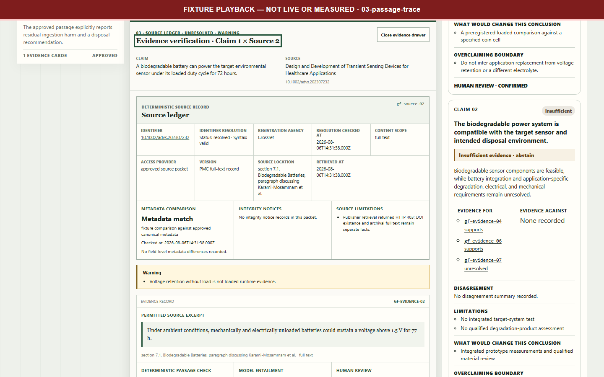
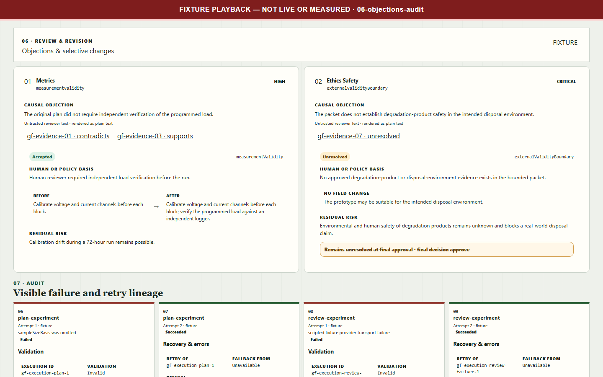
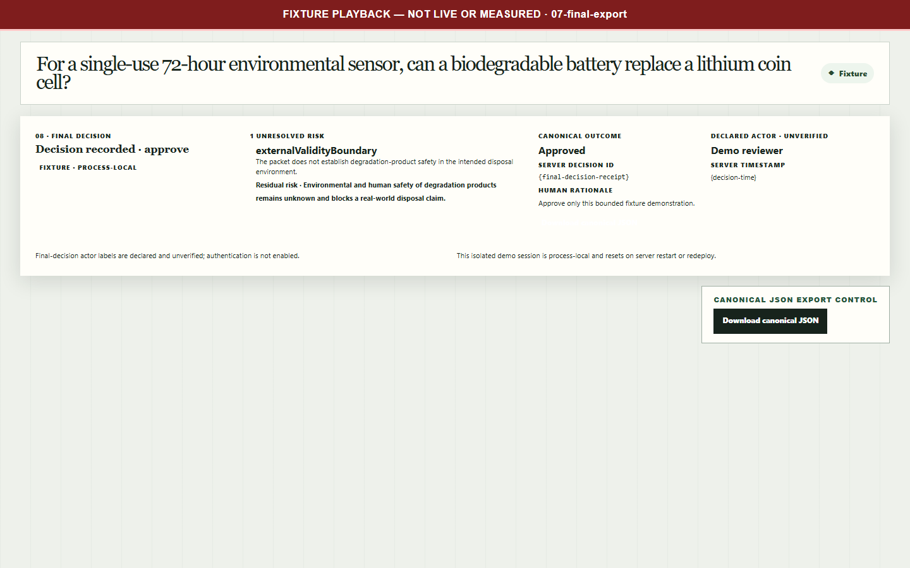

# EvidenceForge

**Turn a bounded source packet into an inspectable claim-to-experiment decision record.**


## Why EvidenceForge

The product is not another open-web research agent. It works from a bounded, frozen, user-approved packet and makes the reasoning trail reviewable:

- **Exact passage provenance:** every evidence card resolves to an immutable source chunk and a literal excerpt.
- **Separate judgment layers:** deterministic verification, model assessment, and human review remain distinct facts.
- **Calibrated synthesis:** conclusions are categorical—never invented confidence percentages—and point to evidence for, against, or still unresolved.
- **Decision-changing gaps:** the workflow selects the missing evidence most likely to change a conclusion instead of presenting generic “future work.”
- **Bounded experiment design:** the proposal records assumptions, controls, stopping rules, missing inputs, and what an outcome would not establish.
- **Adversarial review with human control:** objections cannot silently rewrite the plan; selective human-approved revision applies only accepted changes.
- **Auditable disposition:** failures, retries, unresolved objections, the final human decision, and the canonical export remain linked in one record.

The design goal is inspectability and accountable human governance. The repository contains no completed measurement showing that this workflow outperforms a single-prompt approach.

## How the workflow works

1. **Resolve the question.** Capture intended use, constraints, and a small set of testable claims.
2. **Approve scope.** A human must approve or edit the claim contract before evidence work begins.
3. **Freeze a source packet.** Record source/chunk hashes, access scope, and separate store/display/model-use rights.
4. **Extract and assess evidence.** Link literal passages to claims, then keep existence, metadata, entailment, and human review separate.
5. **Synthesize conclusions.** Produce categorical conclusions and rank one to three evidence-backed research gaps.
6. **Plan a bounded experiment.** Propose an educational, reviewable protocol—or explicitly abstain when necessary inputs are missing.
7. **Review and revise selectively.** A heterogeneous reviewer raises typed objections; a human decides which changes may be applied.
8. **Approve or reject.** Preserve the disposition, unresolved objections, full attempt history, and canonical JSON export.

## Verified capabilities

These capabilities are verified through the committed deterministic fixture, contract tests, and browser journey—not through a successful live end-to-end run:

- blocking human scope and packet-approval gates;
- immutable packet, source, chunk, and excerpt identities;
- literal-substring and reference validation that fails closed;
- distinct application-verification, model-assessment, and human-review fields;
- categorical conflicting/insufficient conclusions and a selected research gap;
- a bounded educational pilot with explicit inferential limits;
- objection-by-objection disposition and a one-to-one selective revision diff;
- retained invalid responses, transport failures, repairs, and retries;
- an explicit final human disposition and deterministic canonical export.







The complete seven-frame sequence and hashes are recorded in the [demo manifest](artifacts/submission/demo-v1/manifest.json), with a timed [fixture demo script](docs/submission/fixture-demo-script-v1.md).

## Architecture and stack

| Layer | Implementation |
| --- | --- |
| Application | Next.js 16 App Router, React 19, TypeScript 6 |
| Contracts | Strict Zod schemas, cross-record invariants, versioned readers, canonical JSON |
| Workflow | Explicit server-side node orchestration with typed failures and human checkpoints |
| Model boundary | Small Featherless adapter; current configuration uses Mistral primary and Qwen reviewer with no fallback |
| Evidence | Frozen packet hashes, rights decisions, exact passage references, categorical assessments |
| Verification | Vitest unit/evaluation contracts and Playwright fixture browser journeys |

Model-facing outputs are treated as untrusted input. Application code owns deterministic IDs, audit identity, verification fields, and human-review fields. A maximum of one repair is allowed, and failed attempts remain visible rather than becoming empty success objects.

## Quick start

Prerequisites: Node.js 20.9 or newer and pnpm 11.16.

```bash
corepack enable
pnpm install --frozen-lockfile
pnpm dev
```

Open [http://localhost:3000/intake](http://localhost:3000/intake), select **Load golden fixture**, and continue through the recorded workbench. Fixture mode is the default and requires no provider credential. Do not describe fixture playback as a live run.

Live mode is separately gated by server-only environment validation. See [.env.example](.env.example) for variable names; never expose provider keys through client-visible variables or commit credentials.

## Verification

Run the same public checks used to protect the documented boundary:

```bash
pnpm unit
pnpm exec vitest run --config evals/vitest.config.mts
pnpm lint
pnpm typecheck
pnpm build
pnpm exec playwright test tests/browser/golden-journey.spec.ts --project=chromium --workers=1
```

Observed on this candidate:

| Check | Result |
| --- | --- |
| Unit suite | Passed: 642 tests; 1 intentional skip |
| Evaluation suite | Passed: 292 tests; 2 optional trusted-private-audit skips |
| Lint and typecheck | Passed |
| Production build | Passed |
| Serial Chromium fixture journey | Passed: 2 tests |
| Dependency audit at high severity | Passed: no known vulnerabilities |

The candidate README is accepted only when the unit and evaluation suites pass, lint/typecheck/build succeed, the serial Chromium fixture journey passes, and public privacy/name/link scans report no findings. Optional verifier-only private-audit checks remain skipped outside their trusted environment; an unavailable private input is never reported as a pass.

## Repository guide

- [Shared research-run contract](docs/architecture/run-contract.md) — lifecycle, invariants, provenance, and human checkpoints.
- [Workflow node reference](docs/submission/workflow-node-reference.md) — each node's input, responsibility, output, and failure boundary.
- [Golden fixture provenance ledger](docs/submission/golden-fixture-provenance-ledger.md) — exact sources, excerpts, hashes, rights scope, and interpretations.
- [Executive summary](docs/submission/executive-summary.md) — concise product and evidence boundary.
- [Canonical approved fixture export](artifacts/submission/demo-v1/canonical-approved-run.json) — deterministic accepted demo record.
- [Research and product basis](docs/RESEARCH_BASIS.md) — dated competitive and design rationale.

## Evidence boundary and current status

| Area | Honest status |
| --- | --- |
| Complete demonstration | Deterministic `fixture` path with seven accepted screenshots and one canonical export |
| Bounded live attempt | Extraction and entailment succeeded; synthesis succeeded after one repair; both planning attempts failed application-schema validation |
| Live end-to-end result | No successful live end-to-end run exists; the bounded live attempt failed at experiment planning |
| Comparative evaluation | The planned benchmark and ablations were canceled and not completed; no superiority conclusion is available |
| Cost and latency | No measured cost study or comparative latency result is available |
| Human rehearsal | Optional and `unverified`; no timing is inferred from the authored script |
| Organizer/Devpost status | No organizer acceptance or Devpost completion is claimed |

The captured submission requirements describe four files while naming three categories. Resolving the four-versus-three ambiguity is an external Devpost submission task, not a blocker to publishing independently verified software. This repository does not invent a fourth artifact.

## Safety, rights, and governance

- EvidenceForge audits only a bounded, user-approved packet. It is not an autonomous scientist, systematic-review service, or unrestricted web-research system.
- A DOI resolution or metadata match does not prove that a passage entails a claim. Those facts remain separate throughout the UI and export.
- Store, display, and model-use rights are independent gates. Missing or denied rights block the affected operation.
- Packet and content hashes prove internal consistency, not source authenticity, completeness, legal clearance, or continuing upstream availability.
- Experiment output is educational and reviewable. It does not authorize diagnosis, hazardous wet-lab work, deployment, or autonomous real-world action.
- Final approval is a declared human decision in a demonstration without authentication; unresolved objections remain visible.

EvidenceForge does not replace researchers. It makes AI-assisted research planning inspectable, falsifiable, and accountable.
